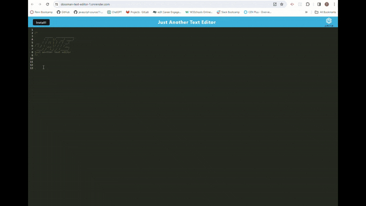
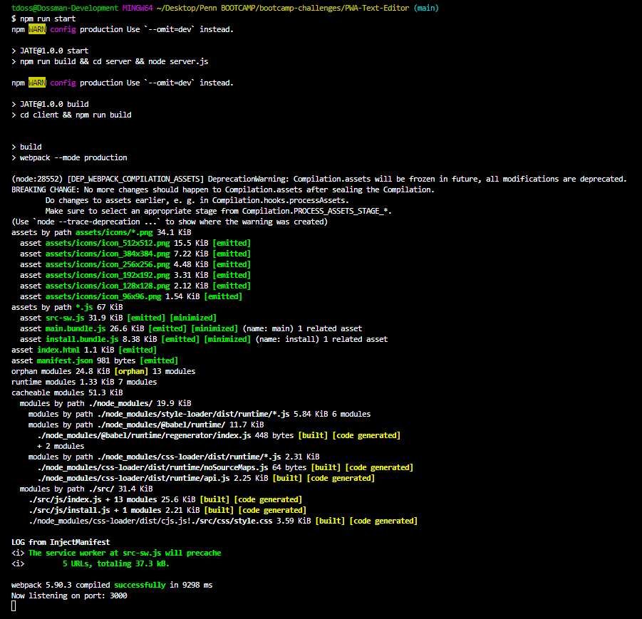
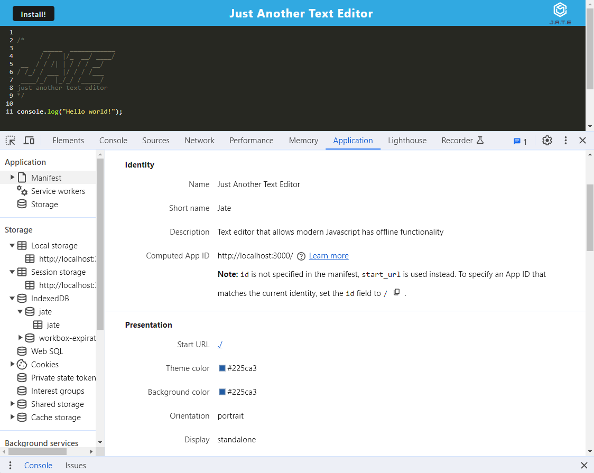
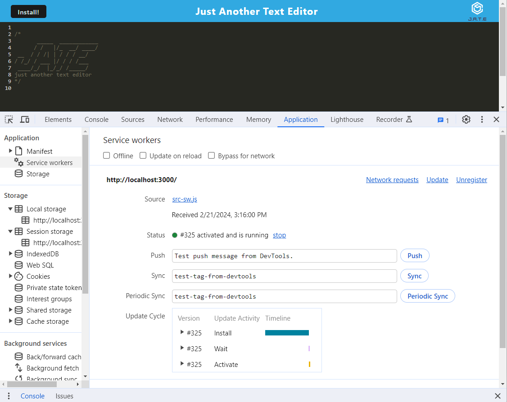
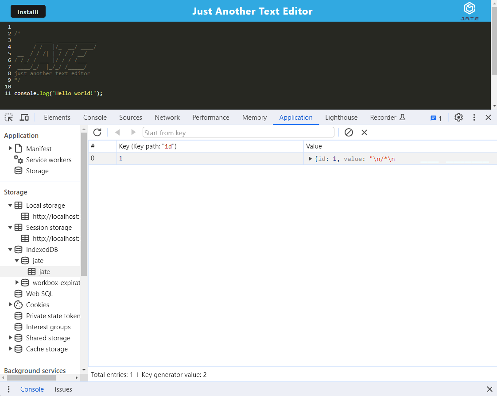
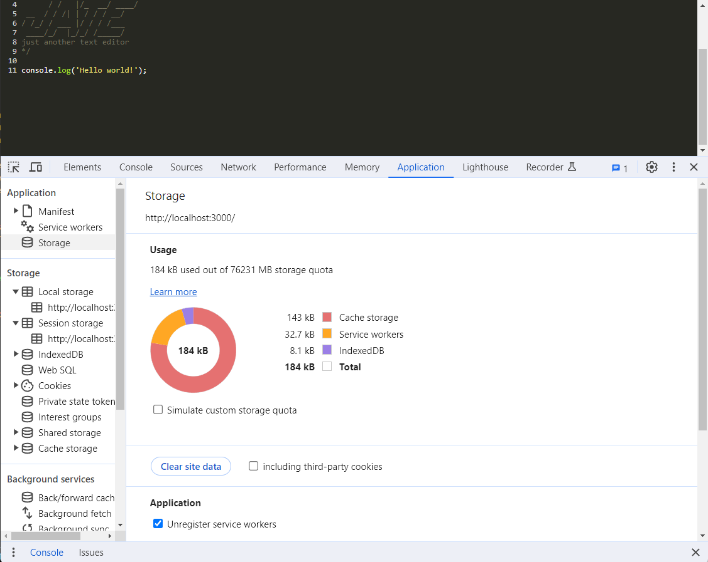

# J.A.T.E. - Progressive Web Application

## License

This project is licensed under the [MIT License] - see [LICENSE](LICENSE) file for more details.

## Description

Welcome to my J.A.T.E. PWA Text Editor project! This browser-based text editor is designed as a single-page application (SPA) that adheres to Progressive Web App (PWA) criteria. It incorporates various data persistence techniques for redundancy and ensures offline functionality.

## Table of Contents

- [License](#license)
- [Description](#description)
- [Features](#features)
- [Demonstration](#demonstration)
- [Screenshots](#screenshots)
- [Usage](#usage)
- [Technologies](#technologies)
- [Questions](#questions)

## Features

### Single-Page Application (SPA):
- The text editor is built as a modern SPA, providing a seamless and responsive user experience.

### Progressive Web App (PWA) Criteria: 
- The application meets the criteria for Progressive Web apps, enhancing user engagement and performance.

### Data persistence Techniques:
- Multiple data persistence techniques are implemented to ensure robustness. These techniques act as redundancy measures, offering resilience in case certain options are not supported by the browser.

### Offline Functionality:
- Users can continue to use the text editor even without an internet connection, enhancing accessibility and usability.

## Demonstration

## Screenshots

### Starting the Application
 

### J.A.T.E. Manifest

### J.A.T.E. Social Worker

### J.A.T.E. IndexedDB

### J.A.T.E. Cache

## Usage

### Visit Deployed Site: 
[click here to try J.A.T.E.](https://dossman-text-editor-1.onrender.com/)

### Contributions welcome:

#### Install

- Clone or Fork the repository from Github to your local machine.
- Open using a source code editor like VScode.
- Open the integrated terminal in the root directory and type the command `npm install` to make the necessary dependency installations. 

#### Start the Server

- Once installations are complete, type the command `npm run start` to start the server.
- The server will be running http://localhost:3000

## Technologies

### Express

### Babel

### CSS-Loader

### HTTP Server

### WebPack

### WebPack-CLI

### WebPack-Dev-Server

### WebPack-PWA-Manifest

### Workbox-Webpack-plugin

### Code-Mirror-Themes

### IDB

## Questions

[Follow me on Github!](https://github.com/Dossman-thomas)

Have any further questions? Feel free to reach me via tdossman.development@gmail.com